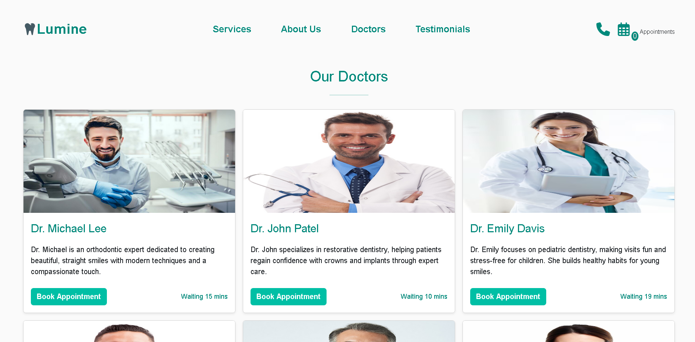
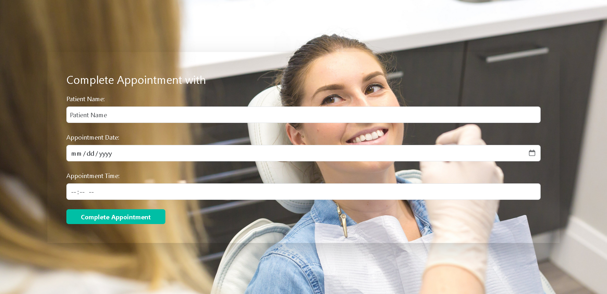

# Lumine

Clinic website

## Table of contents

- [Overview](#overview)
- [The challenge](#the-challenge)
- [Screenshot](#screenshot)
- [Links](#links)
- [Built with](#built-with)

## Overview

A website designed to streamline the process of booking medical appointments and provide comprehensive information about dental clinic services. The project aims to enhance user experience by offering an easy-to-use and interactive interface that allows patients to view available services, learn about specialized doctors, and read reviews from previous patients.

### The challenge

Users should be able to:

- Explore our comprehensive services
- Browse doctors and easily book an appointment
- View real patient experiences with before-and-after results

### Screenshot

### Links

- Live Site URL: [Website](https://makhlouf7.github.io/Dentist-Clinic/)

### Built with

- HTML5
- CSS
- Bootstrap
- JavaScript
- [jQuery](https://jquery.com/) - JS library
